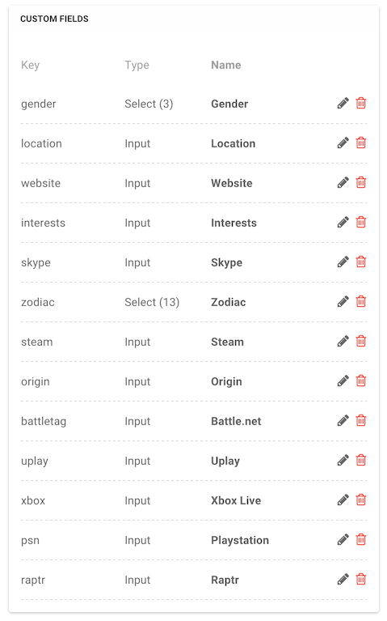
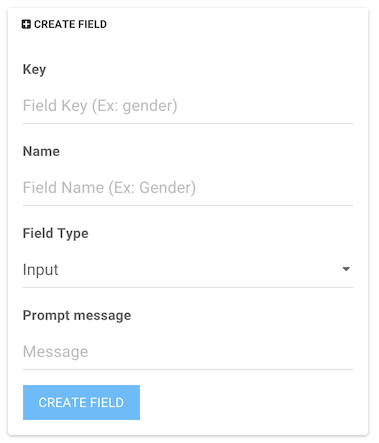

# NodeBB: Custom Fields

Adds additional fields to the user's profile. Would you like to provide gender option for user profiles, or zodiac, or twitter handler, or facebook page, this plugin will help you.


<!-- START doctoc generated TOC please keep comment here to allow auto update -->
<!-- DON'T EDIT THIS SECTION, INSTEAD RE-RUN doctoc TO UPDATE -->
 

- [Screenshots](#screenshots)
  - [Field Management](#field-management)
  - [Field Creation](#field-creation)
- [Themes](#themes)
  - [Profile View](#profile-view)

<!-- END doctoc generated TOC please keep comment here to allow auto update -->

## Screenshots

### Field Management



### Field Creation



## Themes

### Profile View

Plugin provides additional collection under `customFields` field in user data for Account/Profile page.

You can use predefined templates via `IMPORT` directive.

**NodeBB 1.x.x**, Persona, Flex Version (insert link on template in user's profile template wherever you like):

```html
<!-- IMPORT partials/account/custom_fields_flex.tpl -->
```

For old versions of NodeBB/Persona you could use legacy templates:

```html
<!-- IMPORT partials/account/custom_fields_panel.tpl -->
```

or

```html
<!-- IMPORT partials/account/custom_fields_two_columns.tpl -->
```
